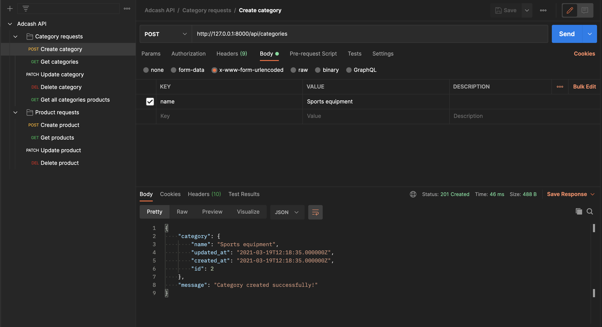
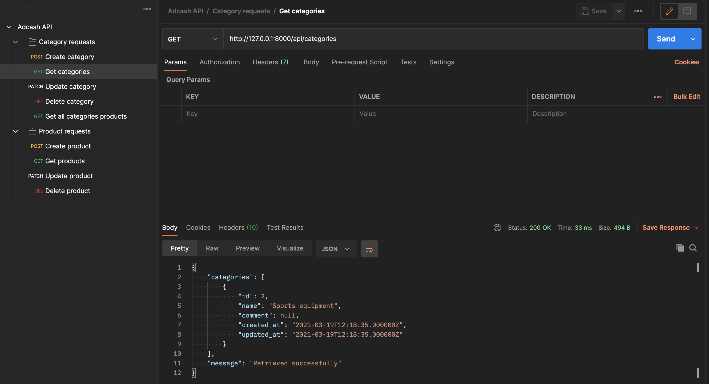
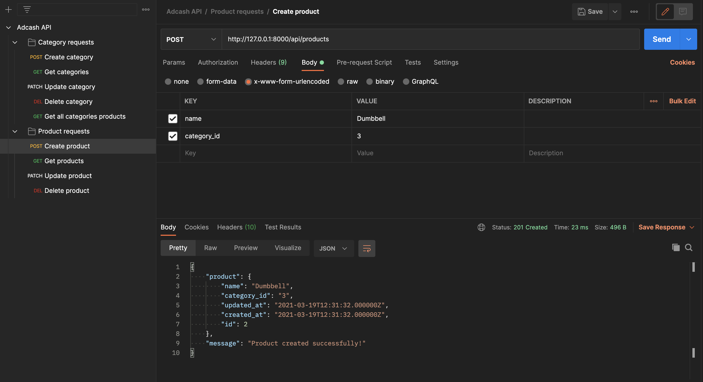
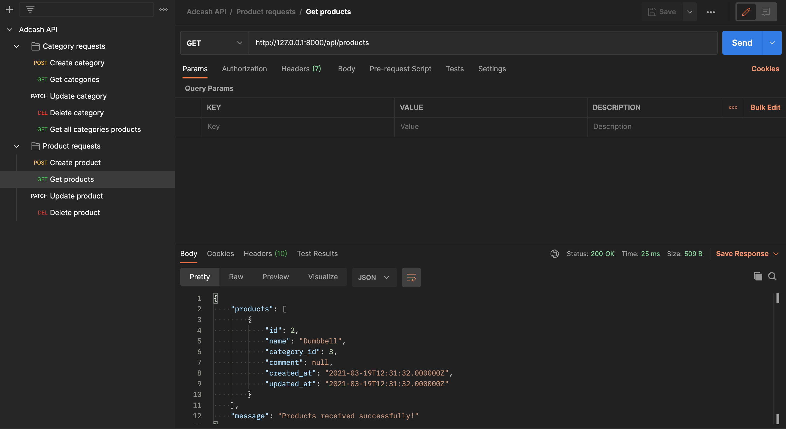

# REST API

### This is my submission for the Adcash backend engineer internship

#
#### Added JSON postman collection for easier testing.
#
### Disclaimer
*If you are not seeing the images in the readMe and/or having the "Failed to load latest commit information." error, it may be caused by AdBlock or Google Chrome.*

 

# SETUP
## Setting up your local database with the App
#
- Make a copy of the ".env.example" file and rename it to ".env"
- Modify the DB details *(the image below)* to match your database connection details

(If you are using a MySql database with default settings, you just have to change the DATABASE, USERNAME and PASSWORD)
#
## Commands
### Run migrations
~~~~
php artisan migrate
~~~~
### Run the project
~~~~
php artisan serve
~~~~

### Run phpunit tests

~~~~
composer test
~~~~

 
 

# Postman test images
## Create category

## Get categories

## Update category

## Delete category

## Create product

## Get products

## Update product

## Delete product

## Get all products of a certain category

